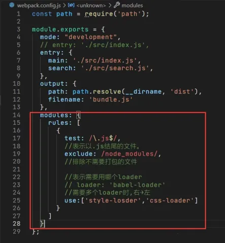

# 1、前言

[Webpack 中文文档](https://www.webpackjs.com/concepts)

> Webpack 是一个用于现代 JavaScript 应用程序的静态模块打包工具。当 Webpack 处理应用程序时，它会在内部从一个或多个入口点构建一个[依赖图(dependency graph)](https://www.webpackjs.com/concepts/dependency-graph)，然后将你项目中所需的每一个模块组合成一个或多个 bundles，它们均为静态资源，用于展示你的内容。

本人带领读者构建一个简易版 Webpack，以便对其原理有进一步的认识。（更多原理请看源码或者其他博主的文章），相关代码已经上传到仓库[weak-webpack](https://github.com/XC0703/weak-webpack)。

本文档已同步掘金文章：[《手把手带你实现一个自己的简易版 Webpack》](https://juejin.cn/post/7496341294589231155)。

# 2、初始化项目

```bash
mkdir weak-webpack
npm init
```

初始化的项目目录如下：<br/> 

其中：

- src 目录：用于存放我们的测试代码

```html
<!-- src\index.html -->

<!DOCTYPE html>
<html lang="en">
	<head>
		<meta charset="UTF-8" />
		<meta name="viewport" content="width=device-width, initial-scale=1.0" />
		<title>weak-webpack</title>
	</head>
	<body>
		<script type="text/javascript" src="../dist/bundle.js" charset="utf-8"></script>
	</body>
</html>
```

```js
// src\index.js

import minus from './minus.js';
import add from './add.js';

console.log('3.75 - 0.25 = ', minus(3.75, 0.25));
console.log('3.50 + 0.25 = ', add(3.5, 0.25));
```

```js
// src\add.js

export default (a, b) => {
	return a + b;
};
```

```js
// src\minus.js

export default (a, b) => {
	return a - b;
};
```

- **weak-webpack.config.js**：配置文件

```js
// weak-webpack.config.js

const path = require('path');

module.exports = {
	entry: './src/index.js',
	mode: 'development',
	output: {
		path: path.resolve(__dirname, './dist'),
		filename: 'bundle.js'
	}
};
```

- **bundle.js**：用于实现打包核心代码，我们待会实现的主要逻辑就在里面。

---

首先我们安装几个要用到的包：

- **@babel/parser**：用于将输入代码解析成抽象语法树（AST）
- **@babel/traverse**：用于对输入的抽象语法树（AST）进行遍历
- **@babel/core**：babel 的核心模块，进行代码的转换
- **@babel/preset-env**：可根据配置的目标浏览器或者运行环境来自动将 ES6 + 的代码转换为 ES5

```bash
npm install @babel/parser @babel/traverse @babel/core @babel/preset-env --save-dev
```

通过 `node bundle.js` 命令运行打包逻辑，在 `scripts` 里面写为：

```json
// package.json

  "scripts": {
    "build": "node bundle.js"
  },
```

自此，我们所有的准备工作都已准备完毕，可以放弃了（bushi）。

# 3、打包核心逻辑

实现大致思路：

1. 首先根据配置文件找到打包入口。

2. 解析入口文件，运用 babel 等插件，构建 AST 语法树，抽出依赖，同时将 es6 代码转换为 es5 代码，并收集依赖。

3. 递归寻找依赖的关系，生成依赖图。

4. 将所有的文件打包成一个文件。

## 3-1 初始化

```js
// bundle.js

const options = require('./weak-webpack.config');
const fs = require('fs');
const path = require('path');
const parser = require('@babel/parser');
const traverse = require('@babel/traverse').default;
const babel = require('@babel/core');

// 创建一个 MiniWebpack 类
class MiniWebpack {
	constructor(options) {
		// 配置项
		this.options = options;
	}

	// 将所有打包逻辑串起来
	bundle() {
		const { entry, output } = this.options;
		// 分析入口文件, 生成依赖图
		const graph = this.analyse(entry);
		const graphStr = JSON.stringify(graph);

		// 生成最终执行的代码
		const code = this.generate(graphStr, entry);

		// 输出文件到指定目录
		this.outputFile(output, code);
	}
}

// 实例化并运行打包
const miniWebpack = new MiniWebpack(options);
miniWebpack.bundle();
```

## 3-2 分析入口文件, 生成依赖图

```js
// bundle.js

	// 解析入口文件
	parse(filename) {
		// 利用 Node 的核心模块 fs 读取文件
		const fileBuffer = fs.readFileSync(filename, 'utf-8');
		// 基于 @babel/parser 解析文件得到 AST
		const ast = parser.parse(fileBuffer, { sourceType: 'module' });
		const deps = {}; // 用来收集依赖
		// 遍历 AST，收集依赖
		traverse(ast, {
			ImportDeclaration({ node }) {
				const dirname = path.dirname(filename);
				const absPath = './' + path.join(dirname, node.source.value);
				deps[node.source.value] = absPath;
			}
		});
		// 代码转换，将代码转换成浏览器可执行的代码
		const { code } = babel.transformFromAst(ast, null, {
			presets: ['@babel/preset-env']
		});
		const moduleInfo = { filename, deps, code };
		return moduleInfo;
	}

  // 收集模块依赖图
	analyse(file) {
		// 定义依赖图
		const depsGraph = {};
		// 首先获取入口的信息
		const entry = this.parse(file);
		console.log('entry', entry);
		return depsGraph;
	}
```

其中：

- **sourceType: 'module'** 表示将文件解析为 ES 模块格式，支持 import 和 export 语法。
- 遍历 AST，收集依赖的逻辑为：
  - 使用 `traverse` 方法遍历 AST。
  - 每当遇到 `ImportDeclaration` 节点时（即 `import` 语句），执行回调函数：
    - `node.source.value` 是 `import` 语句中模块的路径（例如 `import './utils.js'` 中的 `'./utils.js'`）。
    - `path.dirname(filename)` 获取当前文件所在的目录路径。
    - `path.join(dirname, node.source.value)` 将当前文件目录和模块路径拼接，得到模块的绝对路径。
    - 将模块路径（`node.source.value`）和其绝对路径（`absPath`）存储到 `deps` 对象中。
- 使用 `babel.transformFromAst` 方法将 `AST` 转换为浏览器可执行的代码。
  - `null` 表示没有源代码映射（sourceMaps）。
  - `{ presets: ['@babel/preset-env'] }` 指定了 `Babel` 的预设插件，`@babel/preset-env` 用于将 `ES6+` 代码转换为 `ES5` 兼容的代码，以便在浏览器中运行。

当执行`npm run build`打包命令时可以看到终端窗口打印的结果：<br/>

此时继续完善我们的`analyse`方法：

```js
// bundle.js

	// 收集模块依赖图
	analyse(file) {
		// 定义依赖图
		const depsGraph = {};
		// 首先获取入口的信息
		const entry = this.parse(file);
		const temp = [entry];
		for (let i = 0; i < temp.length; i++) {
			const item = temp[i];
			const deps = item.deps;
			if (deps) {
				// 遍历模块的依赖，递归获取模块信息
				for (const key in deps) {
					if (deps.hasOwnProperty(key)) {
						temp.push(this.parse(deps[key]));
					}
				}
			}
		}
		temp.forEach(moduleInfo => {
			depsGraph[moduleInfo.filename] = {
				deps: moduleInfo.deps,
				code: moduleInfo.code
			};
		});
		console.log('depsGraph', depsGraph);
		return depsGraph;
	}
```

此时再次执行打包命令时可以看到终端窗口打印的依赖图：<br/>

## 3-3 根据依赖图生成最终执行的代码

```js
// bundle.js

	// 生成最终执行的代码
	generate(graph, entry) {
		// 是一个立即执行函数
		return `(function(graph){
        function require(file) {
            var exports = {};
            function absRequire(relPath){
                return require(graph[file].deps[relPath])
            }
            (function(require, exports, code){
                eval(code)
            })(absRequire, exports, graph[file].code)
            return exports
        }
        require('${entry}')
    })(${graph})`;
	}
```

- 整体结构：

  ```js
  (function (graph) {
  	// 模块加载逻辑
  })(依赖图graph);
  ```

  - 立即执行函数：通过闭包隔离作用域，避免污染全局环境。
  - 参数 `graph`：传入模块依赖图，结构为 { 文件路径: { `deps`: 依赖表, `code`: 模块代码 } }。

- 定义 `require` 函数：
  ```js
  function require(file) {
  	var exports = {}; // 每个模块的导出对象
  	function absRequire(relPath) {
  		return require(graph[file].deps[relPath]); // 转换相对路径为绝对路径
  	}
  	(function (require, exports, code) {
  		eval(code); // 执行模块代码
  	})(absRequire, exports, graph[file].code);
  	return exports; // 返回模块的导出内容
  }
  ```
  - 功能：模拟 `Node.js` 的 `require`，负责加载并执行指定模块。
  - 关键点：
    - `absRequire`：将相对路径转换为绝对路径（通过查询当前模块的依赖表 `deps`）。
    - 闭包执行：通过立即调用函数，为每个模块创建独立作用域，传入模块所需的 `require`、`exports` 和代码 `code`。
    - `eval(code)`：执行模块转换后的代码，填充 `exports` 对象。
- 启动入口模块：
  ```js
  require('${entry}'); // 从配置的入口文件开始执行
  ```
  - 功能：从入口文件（如 `src/index.js`）开始递归加载所有依赖模块，触发整个应用的执行。

---

```js
// bundle.js

// 生成最终执行的代码
const code = this.generate(graphStr, entry);
console.log('code', code);
```

执行打包命令时看到终端窗口打印的生成的代码：<br/>

## 3-4 指定打包后的文件的目录

这个没什么好讲的，直接看代码即可：

```js
// bundle.js

	outputFile(output, code) {
		const { path: dirPath, filename } = output;
		const outputPath = path.join(dirPath, filename);
		if (!fs.existsSync(dirPath)) {
			fs.mkdirSync(dirPath);
		}
		fs.writeFileSync(outputPath, code, 'utf-8');
	}
```

执行打包命令后打开`src\index.html`可以看到打包结果：<br/>

# 4、嵌入 loader 与 plugin

## 4-1 嵌入 loader

### 4-1-1 实现

> loader 本质上是导出函数的 JavaScript 模块。所导出的函数，可用于实现内容转换，由于 webpack 只能识别 Js 和 Json，因此其它类型的模块，如 css，图片等，必须借助 loader 来处理，说的更明确点，就是将不同类型的文件转换为 webpack  可识别的模块。

因此，开发 loader 也简单，它就是一个输入输出的函数。代码如下：

```js
// bundle.js

// 创建一个 MiniWebpack 类
class MiniWebpack {
	// ...

	// 处理loader
	applyLoaders(filename, source) {
		let processed = source;
		const rules = this.options.module?.rules || [];

		for (const rule of rules) {
			if (rule.test.test(filename)) {
				const loaders = Array.isArray(rule.use) ? [...rule.use].reverse() : [rule.use];
				for (const loader of loaders) {
					let loaderPath;
					if (typeof loader === 'string') {
						loaderPath = loader; // 如果是字符串，直接使用
					} else if (typeof loader === 'object' && loader.loader) {
						loaderPath = loader.loader; // 如果是对象，提取 loader 属性
					} else {
						throw new Error(`Invalid loader configuration: ${JSON.stringify(loader)}`);
					}

					const loaderFn = require(loaderPath);

					processed = loaderFn(processed);
				}
			}
		}
		return processed;
	}

	// 解析入口文件
	parse(filename) {
		// ...

		// 应用loader转换
		fileBuffer = this.applyLoaders(filename, fileBuffer);

		// ...
	}

	// ...
}
```

上边代码有一个需要注意的点：如果对一种后缀配置多个 loader，如 css，数组里面的 loader 是从后往前执行的，因此用 traverse 翻转一下数组顺序。

### 4-1-2 测试

下面对我们所写的代码进行测试，首先增加配置：

```js
// weak-webpack.config.js

const path = require('path');

module.exports = {
	// ...
	module: {
		rules: [
			{
				test: /\.less$/,
				use: [
					'./loaders/style-loader', // 通过 JS 字符串，创建 style node
					'./loaders/css-loader' // 编译 css 使其符合 CommonJS 规范
				]
			}
		]
	}
};
```

注意，`style-loader`、`css-loader`等`loader`是比较复杂的，依赖于`webpack`的内部上下文（如 `this._compiler` 和 `this._module`等），这些属性在我们的自定义 `MiniWebpack` 中并不存在，因此不能导入相应的`npm`包直接使用，而是选择模拟实现这些`loader`：

```js
// loaders\style-loader.js

module.exports = function (source) {
	return `var style = document.createElement('style');
style.type = 'text/css';
style.innerHTML = ${JSON.stringify(source)};
document.head.appendChild(style);`;
};
```

```js
// loaders\css-loader.js

module.exports = function (source) {
	return source.replace(/url\(([^)]+)\)/g, 'url($1)');
};
```

然后在`src`目录下增加`src\index.css`文件并且在`src\index.js`中导入：

```less
// src\index.css

body {
	background-color: red;
}
```

```js
// src\index.js

import './index.css';
```

然后执行`npm run build`打包命令，打开我们的页面可以看到我们的页面有导入的 css 文件样式了，说明起作用了：<br/> 

## 4-2 嵌入 plugin

### 4-2-1 实现

> plugin 为 webpack 的支柱功能，webpack 在构建打包的过程中，会广播出对应的钩子事件，实现不同的功能，可以监听不同的事件，在不同的编译时期对打包过程做出自定义处理。

我们借助`tapable`实现，`tapable` 是一个 `JavaScript` 库，它提供了一种钩子（hook）机制，允许开发者在特定的事件点插入自定义逻辑。它通常被用在需要在特定流程中插入扩展逻辑的场景。

```bash
npm install tapable
```

主要代码修改如下，增加了生命周期钩子与改变了`bundle`方法的逻辑：

```js
// bundle_withplugin.js

// ...

// 创建一个 MiniWebpack 类
class MiniWebpack {
	constructor(options) {
		// ...

		// 定义生命周期钩子
		this.hooks = {
			compile: new SyncHook(),
			afterCompile: new SyncHook(),
			emit: new AsyncSeriesHook(['assets']),
			done: new SyncHook()
		};

		// 注册插件
		if (Array.isArray(this.options.plugins)) {
			this.options.plugins.forEach(plugin => plugin.apply(this));
		}
	}

	// ...

	// 将所有打包逻辑串起来
	bundle() {
		const { entry, output } = this.options;

		// 触发compile钩子
		this.hooks.compile.call(); // 编译开始触发

		// 分析入口文件, 生成依赖图
		const graph = this.analyse(entry);

		// 触发afterCompile钩子
		this.hooks.afterCompile.call(); // // 编译结束触发

		// 生成代码
		const graphStr = JSON.stringify(graph);
		const code = this.generate(graphStr, entry);

		// 准备资源
		const assets = {
			[output.filename]: {
				source: () => code,
				size: () => code.length
			}
		};

		// 输出文件到指定目录
		// 触发emit钩子（异步）
		this.hooks.emit.callAsync(assets, err => {
			// 资源生成触发（异步）
			if (err) throw err;

			// 确保输出目录存在
			const dirPath = output.path;
			if (!fs.existsSync(dirPath)) {
				fs.mkdirSync(dirPath, { recursive: true });
			}

			// 写入所有资源文件
			Object.entries(assets).forEach(([filename, asset]) => {
				const filePath = path.join(dirPath, filename);
				fs.writeFileSync(filePath, asset.source(), 'utf-8');
			});

			// 触发done钩子
			this.hooks.done.call();
		});
	}
}

// 实例化并运行打包
const miniWebpack = new MiniWebpack(options);
miniWebpack.bundle();
```

- **生命周期流程：compile -> afterCompile -> emit -> done 形成完整链条**
- **注意，我们实现 plugin 系统的代码在项目的`bundle_withplugin.js`里面。**

### 4-2-2 测试

新建一个测试的`plugins\html-webpack-plugin.js`文件，来简单实现一个 `HtmlWebpackPlugin` 插件，打包之后生成一个 `html` 文件，并在这个文件中引入打包生成的 `js` 文件。：

```js
// plugins\html-webpack-plugin.js

const fs = require('fs');
const path = require('path');

class HtmlWebpackPlugin {
	constructor(options = {}) {
		this.options = Object.assign(
			{
				filename: 'index.html',
				template: path.resolve(__dirname, 'index.html'), // 默认模板路径
				title: 'weak-webpack'
			},
			options
		);
	}

	apply(compiler) {
		compiler.hooks.emit.tapAsync('HtmlWebpackPlugin', (assets, callback) => {
			// 1. 读取模板文件
			fs.readFile(this.options.template, 'utf8', (err, templateContent) => {
				if (err && err.code === 'ENOENT') {
					// 2. 如果模板不存在，使用默认模板
					templateContent = this.getDefaultTemplate();
				} else if (err) {
					return callback(err);
				}

				// 3. 替换模板变量
				const result = templateContent
					.replace(/<%=\s*htmlWebpackPlugin\.options\.title\s*%>/g, this.options.title)
					.replace(
						/<%=\s*htmlWebpackPlugin\.files\.js\s*%>/g,
						Object.keys(assets)
							.filter(name => name.endsWith('.js'))
							.map(name => `<script src="${name}"></script>`)
							.join('\n')
					);

				// 4. 添加HTML文件到资源列表
				assets[this.options.filename] = {
					source: () => result,
					size: () => result.length
				};

				callback();
			});
		});
	}

	getDefaultTemplate() {
		return `<!DOCTYPE html>
<html>
<head>
  <meta charset="utf-8">
  <title><%= htmlWebpackPlugin.options.title %></title>
</head>
<body>
  <div id="root"></div>
  <%= htmlWebpackPlugin.files.js %>
</body>
</html>`;
	}
}

module.exports = HtmlWebpackPlugin;
```

然后去修改我们的配置：

```js
// weak-webpack.config.js

const path = require('path');
const HtmlWebpackPlugin = require('./plugins/html-webpack-plugin.js');

module.exports = {
	// ...
	plugins: [
		new HtmlWebpackPlugin({
			filename: 'template.html'
		})
	]
};
```

新建一个`npm run build_withplugin`打包命令，因为我们相关逻辑写在`bundle_withplugin.js`里面：<br>

运行打包命令后可以看到`dist`目录下面增加了`template.html`文件：><br>

符合预期，说明我们实现的简易`plugin`系统是正确的。

# 5、一点 Webpack 的八股

## 5-1 webpack 的四个核心概念？

- entry：入口文件，把你指定的文件转换到 dist 文件下，名字为 bundle.js。单入口文件和多入口文件的配置在 webpack.config.js 下：

  ```js
  // entry: './src/index.js',单入口文件

  //多入口文件
  entry:{
  		main:'./src/index.js',
  		search:'./src/search.js',
  	},
  ```

- output：出口文件

  ```js
  //单入口文件对应的出口文件配置
  output: {
  		path: path.resolve(__dirname, 'dist'),
  		filename: 'bundle.js'
  	}

  //多入口文件对应的出口文件配置
  output: {
  		path: path.resolve(__dirname, 'dist'),
  		filename: '[name].js'
  	}
  ```

- loader：
  - loader 让 webpack 能够处理那些非 JS 文件的模块。
  - 在 webpack 的配置中 loader 有两个目标：  
     ● test 属性，用于标识出应该倍对应的 loader 进行转换的某个或某些文件。
    ● use 属性，表示进行转换时，应该使用哪个 loader。
    <br>
  - `webpack` 初入门时强调处理 `css` 文件时一定要使用 `style-loader`，使用 `loader` 的顺序为： `[“style-loader”, “css-loader”, “sass-loader”]`，webpack`调用`loader`是从右往左的，先使用`sass-loader` 将`.less` 或`.scss`文件转换成`css`，再使用 `css-loader`加载`css`文件，最后使用`style-loader`将`css-loader`处理的样式注入到`HTML` 页面中。
- plugins（插件）：loader 被用于帮助 webpack 转换某些类型的模块，而插件则可以用于执行范围更广的任务。插件的范围包括，从打包优化和压缩，一直到重新定义环境中的变量。

## 5-2 webpack 实现热更新的原理？

参考博客：
[轻松理解 webpack 热更新原理](https://juejin.cn/post/6844904008432222215)
[【Webpack 进阶】聊聊 Webpack 热更新以及原理](https://juejin.cn/post/6939678015823544350)

webpack 的 devServer 支持使用 Hot Module Replacement (HMR) 技术来实现热更新，其原理是将应用程序的代码在运行过程中替换为新的模块代码，而不需要刷新整个页面。

为了实现 HMR，webpack 对模块机制做了一些特殊的处理。当 socket server 监听到对应的模块发生变化时（热更新实际上就是服务器端的更新通知到客户端），会生成两个文件.json（manifest 文件，浏览器根据 manifest 文件获取模块变化的内容，从而触发 render 流程，实现局部模块更新）和.js 文件（update chunk），在 devServer 中会调用 webpack 的 HMR runtime 来更新模块。

> HMR runtime 是一个客户端运行时环境，它通过与 devServer 建立的 WebSocket 连接监听是否有模块需要更新，并且实现了模块热更新的逻辑。当 HMR runtime 接收到模块需要更新的通知后，它会首先从 devServer 上获取最新的代码，然后使用 webpack 的模块系统执行新代码（局部刷新使用的是 webpackHotUpdate 这个 API，其原理是通过创建 script 标签添加 src 的形式插入 dom 执行的），以此实现热更新。<br>
> 在配置中启用 Hot Module Replacement 功能只需要简单地将 devServer 的 hot 选项设置为 true，即可启动该功能。同时，还需要在 webpack 配置文件中增加 HotModuleReplacementPlugin 插件来支持 HMR 功能。

## 5-3 webpack 是如何打包的？（打包原理）

webpack 的打包主要分成几个步骤：

1. 解析入口文件：Webpack 从入口文件 Entry 开始递归分析依赖关系来确定需要打包的模块。入口文件可以是一个或多个，Webpack 会自动处理它们之间的依赖关系。
2. 加载模块：Webpack 根据模块的路径和类型，使用合适的 loader 来加载模块。例如，如果模块是一个 CSS 文件，Webpack 会使用 CSS loader 来加载它。
3. 转换模块：一旦模块被加载进来，Webpack 会根据配置中的规则（rules）来对模块进行转换。这些规则可以将模块转换成 JavaScript 可以识别的代码 AST 抽象语法树，也可以对模块进行其他处理。
4. 解析依赖：Webpack 在加载每个模块时，会递归地查找该模块依赖的其他模块，并且重复以上步骤，直到所有依赖的模块都被加载进来变成一个完成的 chunk 包。
5. 打包输出：最后，Webpack 将所有的模块 chunk 打包成一个或多个 bundle 包，并将它们输出到指定的目录中。在这个过程中，Webpack 还会进行代码压缩、模块合并等优化操作，以便减小文件大小、提高加载速度等。
   > 参考博客：<br>[前端打包中 Module、Chunk、Bundle 的区别](https://zhuanlan.zhihu.com/p/611518123)<br>
   > ● webpack 的 chunk 是指在打包过程中生成的代码块，这些代码块包含了不同的模块和依赖关系。在 Webpack 的打包过程中，将所有的模块和依赖关系分割成不同的 chunk，可以有效地减小打包文件的大小，提高网页的加载速度。Webpack 提供了多种 chunk 的生成方式，例如使用 entry 配置多个入口文件、通过 import()动态引入的代码、使用 Code Splitting 等。<br>
   > ● bundle 是 webpack 打包之后的各个文件，一般就是和 chunk 是一对一的关系，bundle 就是对 chunk 进行编译压缩打包等处理之后的产出<br>

## 5-4 webpack 如何优化打包构建速度？

可以参考这里：[如何提⾼ webpack 的打包速度?](https://juejin.cn/post/6941278592215515143#heading-25)

- 打包构建速度的优化：
  - 优化 babel-loader（在 config 文件的 rules 里面配置 loader 缓存，只要是 es6 代码没有改动的部分，下次重新构建的时候可以使用缓存，不被重新编译）
  - 引入 IgnorePlugin 插件，避免引入无用模块
  - 配置 noParse，避免重复模块化解析一些如 xx.min.js 之类的文件
  - 利用 happyPack 实现多进程打包
  - 利用 ParallelUglifyPlugin 这个插件实现多进程压缩 js（生产环境中使用）
  - 配置 devServer 里面的 hot 热更新
- webpack 打包产物体积的优化：看下面。

## 5-5 如何降低 webpack 的打包体积？

参考博客：[如何减少 Webpack 打包体积?](https://juejin.cn/post/6941278592215515143#heading-31)

- 按需加载
- Scope Hoisting：Scope Hoisting 会分析出模块之间的依赖关系，尽可能的把打包出来的模块合并到一个函数中去。
- Tree Shaking：Tree Shaking 可以实现删除项目中未被引用的代码。

## 5-6 treeshaking 具体怎么 shaking 的？

Tree shaking 的过程主要依赖于 ES6 的模块特性，即 import 和 export。ES6 模块的静态结构特性，使得我们可以在编译阶段就确定哪些模块会被使用，哪些不会。这样，打包工具（如 Webpack，Rollup 等）就可以在打包过程中，将那些没有被引用的模块剔除掉，从而达到减小最终打包文件体积的目的。

需要注意的是，Tree shaking 并不是在运行时进行的，而是在编译阶段。因此，它并不能处理动态引入的模块。另外，如果代码中存在副作用（side effects），也可能影响 Tree shaking 的效果。

## 5-7 为什么 webpack 的 proxy 配置可以解决跨域？

webpack 的 proxy 配置可以解决跨域问题，因为它使用了 http-proxy-middleware 来实现代理。这样，当你在本地开发时，你可以把你的请求转发到目标服务器上，因为服务器与服务器之间请求数据并不会存在跨域行为，跨域行为是浏览器安全策略限制。这只适用于开发阶段，不适用于线上环境。

## 5-8 webpack 常用 loader 有哪些？

webpack 是一个前端构建工具，它可以通过 loader 来处理各种类型的文件，比如 js、css、图片等。loader 是一种函数，它接收一个源文件作为输入，然后返回一个转换后的结果作为输出。webpack 常用的 loader 有：

- style-loader：用于将 css 编译完成的样式，挂载到页面 style 标签上。
- css-loader：用于解析 css 文件中的@import 和 url()等语法。
- less-loader：用于将 less 文件编译成 css 文件。
- file-loader：用于处理文件资源，比如图片、字体等，可以指定输出目录和文件名。
- url-loader：用于处理小文件资源，可以将它们转换成 base64 编码的 data URL，减少 http 请求。
- babel-loader：用于将 ES6+的代码转换成 ES5 的代码，兼容更多浏览器。
- eslint-loader：用于检查 js 代码的语法和风格是否符合规范。

## 5-9 url-loader 和 file-loader 的区别？

url-loader 和 file-loader 的区别主要有以下几点：

- file-loader 会将文件的 import 或 require 解析为 url，并将文件复制到输出目录中。
- url-loader 可以根据文件大小，将小于设定阈值的文件转换为 base64 字符串，嵌入到代码中，减少 http 请求。大于阈值的文件则交给 file-loader 处理。
- url-loader 相当于封装了 file-loader，但不依赖于 file-loader。

## 5-10 webpack 的 loader 和 plugin 在执行时间上有没有区别？

webpack 的 Loader 和 Plugin 在执行时间上是有区别的。

Loader 是在 webpack 处理模块时执行的，也就是在打包时对每个模块进行转换的过程中，执行相应的 loader 来完成代码的转换。例如将 ES6 的代码转换为 ES5，或是将 LESS、SASS 等 CSS 预处理器的语法转换为普通的 CSS 等。

Plugin 则是在 webpack 执行的生命周期中的特定时刻，通过使用钩子函数（hooks）对打包流程进行干预，修改输出结果或者执行一些额外的任务。比如在构建前生成一个 manifest 文件，压缩输出等。

因此，Loader 和 Plugin 主要的区别在于作用对象和时间点不同。Loader 作用于每个模块，用于转换代码，而 Plugin 则是作用于整个打包流程中，在执行过程中做一些额外的操作。（plugin 在 webpack 的生命周期中一直存在）

## 5-11 知道怎么写一个 plugin 插件吗？

写一个 webpack 插件需要以下几个步骤：

1. 创建一个 JavaScript 类函数，并在其原型（prototype）中定义一个 apply 方法，该方法会注入一个 compiler 对象。
2. 在 apply 方法中通过 compiler 对象插入指定的事件钩子，在钩子回调中拿到 compilation 对象。
3. 使用 compilation 对象操纵修改 Webpack 内部实例数据。
4. 如果插件是异步的，那么处理完数据后需要使用 callback 回调通知 Webpack。

下面是一个简单的 webpack 插件示例，它会在 webpack 打包结束时输出一条信息：

```js
class MyPlugin {
	apply(compiler) {
		compiler.hooks.done.tap('MyPlugin', stats => {
			console.log('Webpack build is done!');
		});
	}
}

module.exports = MyPlugin;
```

在这个示例中，我们创建了一个名为 MyPlugin 的类，并实现了 apply 方法。在 apply 方法中，我们通过 compiler 对象访问了 Webpack 环境配置，并使用 compiler.hooks.done 方法注册了一个回调函数。在这个回调函数中，我们打印了一条信息来表示 Webpack 打包已完成。最后，我们将 MyPlugin 导出供 Webpack 使用。

当我们在 Webpack 配置文件中引入并使用这个插件时，它会自动注册到 Webpack 构建流程中，并在特定的事件钩子触发时执行相关操作。例如，在上面的示例中，我们在 Webpack 打包完成时输出了一条信息。

对于更复杂的插件，可能需要对 Webpack 内部数据模型和事件流有更深入的了解。

## 5-12 对 babel 的了解？

Babel 是一个 JavaScript 编译器主要用于将高版本的 JavaScript 代码转为向后兼容的 JS 代码，从而能让我们的代码运行在更低版本的浏览器或者其他的环境中。

babel5 及之前是一个包含 CLI 工具+编译器+转换器的集合工具包；babel6 之后进行了拆分，集合包被分成多个包：

- babel-cli，其中包含 babel 命令行界面
- babel-core，包括了 Node 有关的 API 和 require 钩子
- babel-polyfill，可以建立一个完整的 ES2015 环境

babel6 默认情况下不携带任何转换器，需要自行安装所需的插件和转换器，通过 babel-xxx 来安装对应的工具包。

而 Babel7 用了 npm 的 private scope，把所有的包都挂载@babel 下，通过@babel/xxx 来安装，不用在 node_modules 下看到一堆的 babel-xxx 包。

对于 babel 的配置文件，主要是配置文件里面的 presets 和 plugins 属性。

## 5-13 babel 的配置文件有没有去看过？

Babel 的配置文件是 Babel 执行时默认会在当前目录寻找的文件，主要有.babelrc，.babelrc.js，babel.config.js 和 package.json。它们的配置项都是相同，作用也是一样的，只需要选择其中一种。对于.babelrc，它的配置是这样子：

```js
{
  "presets": ["es2015", "react"],
  "plugins": ["transform-decorators-legacy", "transform-class-properties"]
}
```

其中，presets 是预设的插件集合，而 plugins 则是单个插件。

具体来说，presets 是一系列相关的插件的集合，可以简单理解为预设的编译方案，包括了一些常见的转换插件，比如将 ES6 转换为 ES5，将低版本浏览器不支持的语法转换为兼容的语法等。通过配置 presets，可以轻松地实现一次性的、全面的转换。

而 plugins 则是针对具体的转换场景，只包含单个插件，可以根据需要自由选择添加。例如，如果只需要将箭头函数转换为普通函数，那么只需要添加 arrow function 插件即可。与 presets 不同，需要逐个的配置并添加到 babel 的配置文件中。
